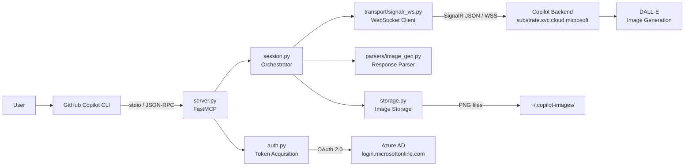
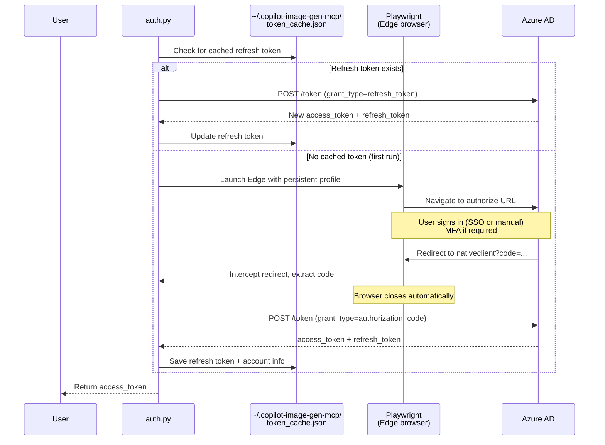
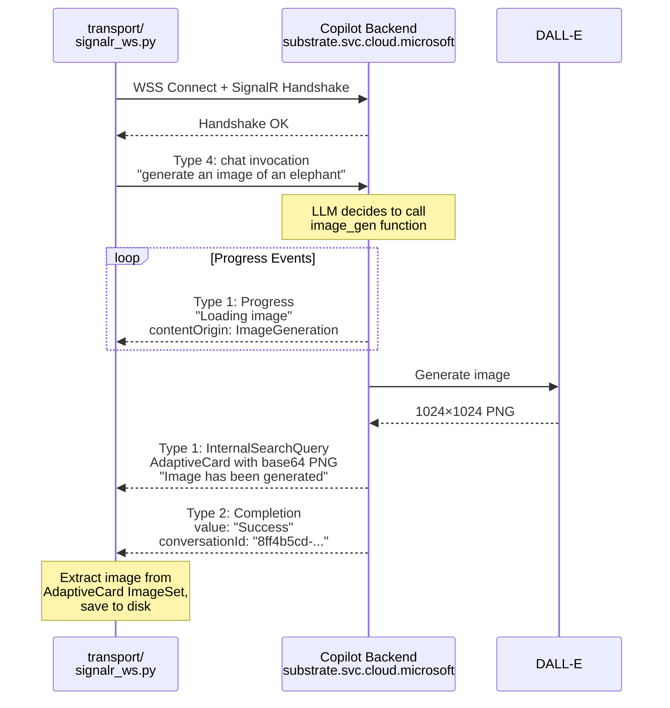
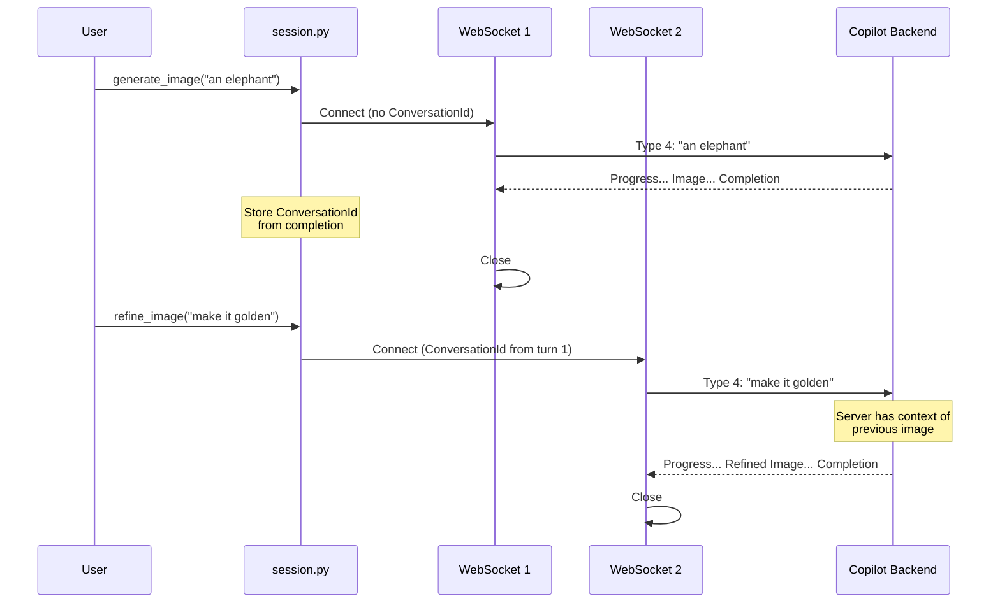

# Technical Documentation

This document explains the internals of the Copilot Image Generation MCP server — how authentication works, how the SignalR WebSocket protocol works, how images are delivered, and how the components fit together.

## System Architecture



### Module Responsibilities (SOLID)

| Module | Responsibility | SOLID Principle |
|--------|---------------|-----------------|
| `server.py` | MCP tool definitions, stdio transport | SRP |
| `session.py` | Multi-turn conversation orchestration | SRP |
| `transport/signalr_ws.py` | SignalR JSON over WebSocket protocol | OCP/DIP — swappable transport |
| `parsers/image_gen.py` | AdaptiveCard image extraction | ISP/OCP — pluggable parsers |
| `auth.py` | Token acquisition, refresh, caching | SRP |
| `storage.py` | Cross-platform image file I/O | SRP |
| `config.py` | Centralized configuration, env overrides | SRP |
| `models.py` | Pure dataclasses (no behavior) | SRP |

See `.github/copilot-instructions.md` for the full SOLID design guide.

## Authentication

### Token Requirements

The Copilot backend validates the `appid` claim in the JWT. This is a Microsoft 1st-party public OAuth client — the same app ID used by the official Copilot web experience:

| Client ID | Display Name | Used For | Notes |
|-----------|-------------|----------|-------|
| `c0ab8ce9-e9a0-42e7-b064-33d422df41f1` | M365ChatClient | Copilot web app | **Used by this project** |
| `https://substrate.office.com/sydney` | Sydney Resource | Token audience | `aud` claim in JWT |

The token must have:
- `aud` = `https://substrate.office.com/sydney`
- `appid` = `c0ab8ce9-e9a0-42e7-b064-33d422df41f1`

> **About "Sydney"**: This is Microsoft's internal codename for Copilot/Bing Chat — it is a **fixed resource identifier**, not a geographic region. The actual WebSocket endpoint (`substrate.svc.cloud.microsoft`) handles geo-routing transparently.

### Auth Flow

We use the OAuth 2.0 Authorization Code flow with the M365ChatClient app's registered `nativeclient` redirect URI. [Playwright](https://playwright.dev/python/) automates the browser sign-in and captures the auth code automatically — identical behavior on macOS and Windows.



Playwright uses a persistent browser profile at `~/.copilot-image-gen-mcp/browser_profile/`, so SSO cookies survive across sign-ins. If your Edge profile supports SSO, sign-in may complete without any manual interaction.

### Key OAuth Parameters

| Parameter | Value |
|-----------|-------|
| Redirect URI | `https://login.microsoftonline.com/common/oauth2/nativeclient` |
| Scope | `https://substrate.office.com/sydney/.default openid profile offline_access` |
| Token endpoint | `https://login.microsoftonline.com/{tenant}/oauth2/v2.0/token` |
| Response mode | `query` |

### The Nativeclient Redirect

The `nativeclient` redirect page contains JavaScript that redirects to `/common/wrongplace` after 3 seconds. Playwright intercepts the redirect URL before the JavaScript fires, so the auth code is captured reliably regardless of platform.

### Refresh Token Lifecycle

- Refresh tokens are valid for approximately **90 days** with a sliding window
- Each use resets the 90-day clock
- Tokens are cached at:
  - macOS/Linux: `~/.copilot-image-gen-mcp/token_cache.json` (mode 0600)
  - Windows: `%LOCALAPPDATA%\copilot-image-gen-mcp\token_cache.json`

## Communication Protocol

The image generation backend uses a **SignalR JSON protocol over WebSocket**.

### WebSocket Endpoint

```
wss://substrate.svc.cloud.microsoft/m365Copilot/Chathub/{oid}@{tid}
```

Where `{oid}` and `{tid}` are the user's Object ID and Tenant ID from JWT claims.

### Required URL Parameters

| Parameter | Value | Notes |
|-----------|-------|-------|
| `access_token` | Bearer JWT | For the Sydney resource |
| `source` | `officeweb` | Client source identifier |
| `product` | `Office` | Product identifier |
| `agentHost` | `Bizchat.FullScreen` | Host context |
| `licenseType` | `Premium` | License tier |
| `agent` | `work` | Agent type |
| `scenario` | `officeweb` | Scenario identifier |
| `variants` | Feature flags | ~2000 chars, **required** (see below) |
| `ConversationId` | UUID | Server-assigned, passed for multi-turn |
| `X-SessionId` | UUID | Client-generated session ID |
| `chatsessionid` | UUID | Client-generated per-turn request ID |
| `clientrequestid` | UUID | Same as chatsessionid |

### Required Headers

| Header | Value |
|--------|-------|
| `Origin` | `https://m365.cloud.microsoft` |

The Origin header is enforced via CORS. Without it, the server returns a `CorsValidator` error: "The allowed origin header () value doesn't equal with the origin."

### Feature Flags (Variants)

The `variants` URL parameter is **required** for image generation. Without the critical flags, the server returns:

> "OperationNotSupported — completion operation does not work with specified model."

Key image generation flags:
- `cdximagen` — enables the image generation capability
- `feature.bizchatfluxv3` — enables the Flux v3 orchestration layer
- `feature.enableGenerateGraphicArtOptionsSet` — graphic art options
- `feature.EnableDesignerEditor` — Designer editor integration
- `Agt_bizchat_enableGpt5ForHelix` — enables the Helix processing path

The full variants string (~2000 chars) is defined in `config.py` and can be overridden via the `COPILOT_VARIANTS` environment variable.

## SignalR Protocol

### Framing

Messages are JSON objects delimited by `\x1e` (ASCII Record Separator, U+001E). Multiple messages may arrive in a single WebSocket frame.

### Handshake

```
Client → Server: {"protocol":"json","version":1}\x1e
Server → Client: {}\x1e
```

An empty response `{}` indicates success. An `"error"` field indicates failure.

### Message Types

| Type | Direction | Meaning |
|------|-----------|---------|
| 1 | Server → Client | Stream item (progress updates, image delivery) |
| 2 | Server → Client | Invocation completion (success) |
| 3 | Server → Client | Invocation completion (error) |
| 4 | Client → Server | Invocation (chat message) |
| 6 | Both | Keepalive ping/pong |

## Image Generation Flow



### 1. Client Sends Chat Message (Type 4)

```json
{
  "type": 4,
  "invocationId": "0",
  "target": "chat",
  "arguments": [{
    "source": "officeweb",
    "optionsSets": ["enterprise_flux_image", "flux_v3_image_gen_enable_dimensions", ...],
    "allowedMessageTypes": ["Chat", "Progress", "InternalSearchQuery", ...],
    "isStartOfSession": false,
    "sessionId": "<client-generated-uuid>",
    "clientCorrelationId": "<request-uuid>",
    "traceId": "<request-uuid>",
    "message": {
      "author": "user",
      "inputMethod": "Keyboard",
      "text": "generate an image of an elephant",
      "messageType": "Chat",
      "requestId": "<request-uuid>",
      "experienceType": "Default",
      "locale": "en-us"
    },
    "clientInfo": {
      "clientPlatform": "mcmcopilot-web",
      "clientAppName": "Office",
      "clientEntrypoint": "mcmcopilot-officeweb"
    },
    "tone": "Magic",
    "disconnectBehavior": "continue",
    "streamingMode": "ConciseWithPadding",
    "plugins": [{"Id": "BingWebSearch", "Source": "BuiltIn"}]
  }]
}
```

Key `optionsSets` for image generation:
- `enterprise_flux_image` — enables the image generation flow
- `flux_v3_image_gen_enable_dimensions` — dimension control
- `flux_v3_image_gen_enable_system_text_with_params` — parameterized prompting
- `flux_v3_image_gen_enable_designer_dimensions_meta_prompting_in_system_prompts`

### 2. Server Sends Progress Events (Type 1)

```json
{
  "type": 1,
  "target": "update",
  "arguments": [{
    "messages": [{
      "text": "Loading image",
      "messageType": "Progress",
      "contentOrigin": "ImageGeneration",
      "contentGenerationProgressList": [{
        "pollUrl": "https://designerapp.officeapps.live.com/...",
        "fileToken": "<jwe-token>",
        "size": "1024x1024",
        "orientation": "Square"
      }]
    }]
  }]
}
```

Multiple progress events arrive during generation (typically 5-8 over 15-30 seconds).

### 3. Server Sends Image (Type 1)

The image arrives as a base64-encoded PNG inside an AdaptiveCard `ImageSet`:

```json
{
  "type": 1,
  "target": "update",
  "arguments": [{
    "messages": [{
      "text": "Image has been generated",
      "messageType": "InternalSearchQuery",
      "adaptiveCards": [{
        "body": [{
          "type": "ImageSet",
          "images": [{
            "type": "Image",
            "url": "data:image/png;base64,iVBORw0KGgo..."
          }]
        }]
      }]
    }]
  }]
}
```

Image details:
- Format: PNG, 1024×1024, 8-bit RGB
- Size: ~150KB–3MB depending on complexity
- Delivery: inline base64 data URI in the WebSocket message
- Path metadata: `DallEGeneratedImages/dalle-{uuid}{timestamp}.png`

> **Note**: A single WebSocket message can contain **both** a Progress sub-message and the image delivery. The parser must check for images before consuming progress events, or the image can be missed.

### 4. Server Sends Completion (Type 2)

```json
{
  "type": 2,
  "invocationId": "0",
  "item": {
    "conversationId": "8ff4b5cd-f850-4099-a2da-ea136dd66e76",
    "result": {
      "value": "Success",
      "serviceVersion": "1.0.03378.23011"
    },
    "messages": [...]
  }
}
```

The `conversationId` in the completion is the server-assigned ID used for multi-turn refinement.

## Multi-Turn Refinement



Key points:
1. **Same ConversationId** — passed as URL parameter for subsequent turns
2. **New WebSocket per turn** — each turn opens a fresh connection
3. **Server-side history** — the backend maintains full conversation context
4. **No previousMessages** — client does not replay history; all context is server-side
5. **Same session directory** — all images from one conversation saved together

## Image Delivery Details

### Inline vs. Full-Resolution

| Source | Size | Format | Auth |
|--------|------|--------|------|
| WebSocket inline | ~150KB–3MB | base64 data URI in AdaptiveCard | Included in WS message |
| Designer full-res | ~3MB | PNG via HTTPS | JWE token (server-issued) |

This MCP server uses the **inline WebSocket delivery** (1024×1024 PNG). The full-resolution Designer fetch requires a separate JWE-authenticated request and is not implemented.

### Image Model

- **DALL-E** — identified by file paths containing `DallEGeneratedImages/dalle-*`
- The exact model version is not exposed in the protocol — the server chooses
- The LLM invokes `image_gen` as an OpenAI-style function/tool call internally
- "Flux" in optionsSets/variants refers to Microsoft's internal orchestration layer, **not** the Flux image model
